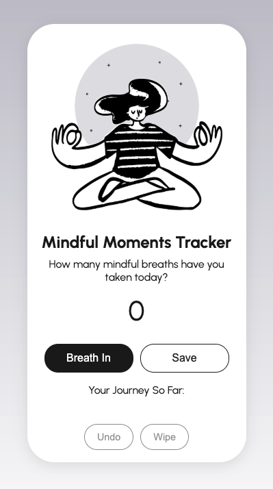

# counter-app-scrimba-project
A beginner-friendly breath tracker built for Scrimba’s Making Websites Interactive module. Uses HTML, CSS, and JavaScript to increment, save, undo, and clear mindful breaths — styled as a mobile-inspired UI with interactive DOM elements.

# 🧘‍♀️ Mindful Moments Tracker

A simple, beginner-friendly web project to track mindful breaths taken throughout the day — designed to look like a mobile screen inside your browser.

This is my first solo project from Scrimba’s *Making Websites Interactive* module (Frontend Career Path). The goal was to apply foundational JavaScript concepts and DOM manipulation to make a webpage interactive using buttons and counters.

## 🛠️ Key Features
- Increment button to count mindful breaths
- Save button to log and reset the counter
- Undo button to reset the current count
- Wipe button to clear the entire log

## 💡 Technologies & Concepts Used
- **HTML5**: Semantic structure (`main`, `section`, `output`)
- **CSS3**: Flexbox layout, border-radius, box-shadow, responsive sizing with `max-width`, Google Fonts
- **JavaScript**: DOM manipulation with `getElementById`, event listeners via `onclick`, `textContent`, conditionals
- **UX/UI considerations**: disabled/active button states, accessibility through `output` tag

## 🧠 Bonus Learning
Beyond the official course material, I used:
- **Google** and **developer forums** to learn how to implement `Undo` and `Wipe` functionalities
- Code cleanup and responsive structure improvements with guidance and self-research

## 📱 Responsiveness
While this project was designed with a fixed-size "mobile frame", the layout uses flexible CSS properties (`max-width`, `height: auto`, `flexbox`) to keep elements stable when resizing the browser.

## 📸 Preview

Here’s what the project looks like:

### 🚀 Live Demo

[Click here to try the project](https://counter-app-scrimba-project-pstroka.netlify.app/)

**Built with care and curiosity — one breath at a time.**

---

📄 License
This project is for educational purposes only and is not intended for commercial use.
